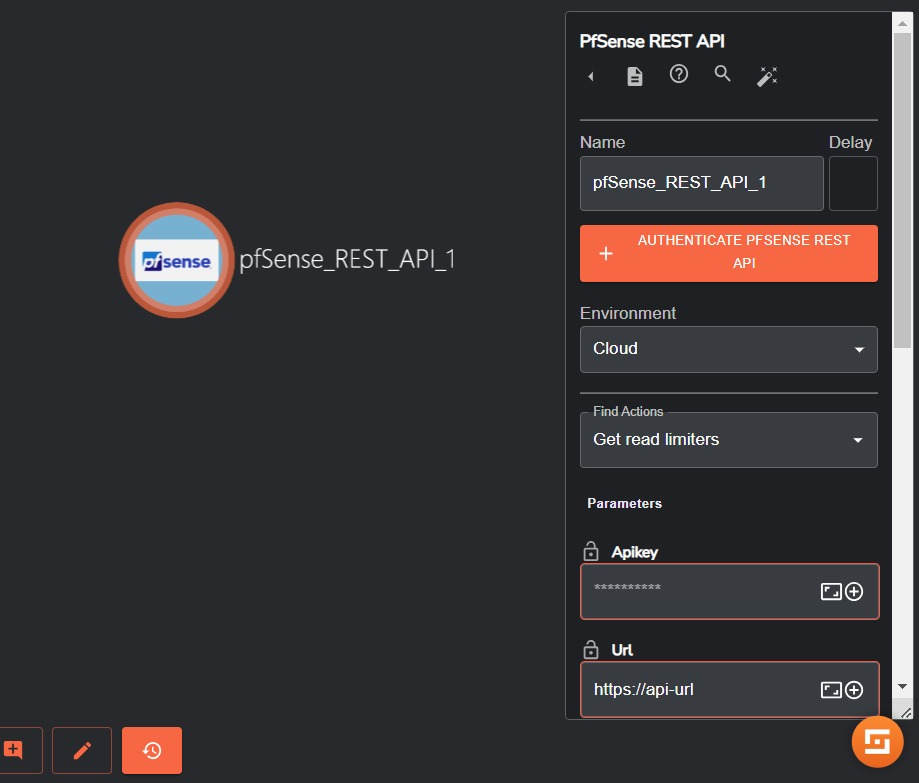
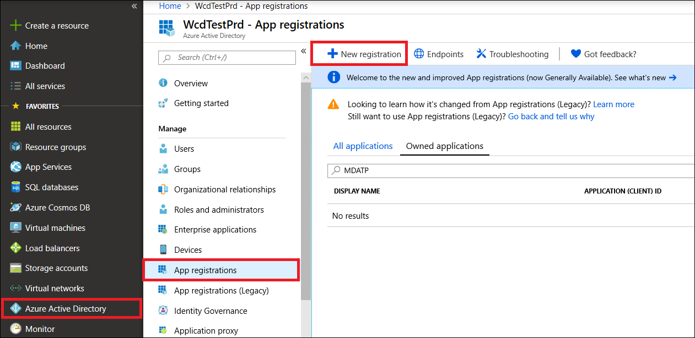

# Pfsense Documentation

## Authorization

PfSense API uses the same privileges as the pfSense webConfigurator. The required privileges for each endpoint are stated within the API documentation.

## Authentication

By default, pfSense API uses the same credentials as the webConfigurator. This behavior allows you to configure pfSense from the API out of the box, and user passwords may be changed from the API to immediately add additional security if needed.

- Navigate to System > API in the pfSense webConfigurator to configure API authentication.

- To authenticate your API call, follow the instructions for your preferred configured authentication mode. In Shuffle Pfsense has been configured to wor with the API Token.

### API Token

- To generate or revoke credentials, navigate to System > API, within the webConfigurator and ensure the Authentication Mode is set to API token. 

- Then you should have the options to configure API Token generation, generate new tokens, and revoke existing tokens. 

- After generating a new API token, the actual token will display at the top of the page on the success banner. This token will only be displayed once so ensure it is stored somewhere safe.

### In Shuffle
- Drag in your Pfsense App into your workflow, and then click on it.
- In the pop up window to the right, click on the authenticate button.



- Fill in your Pfsense URL, and for the API key parameter you will fill it as follows, ensure there is a space between the Client ID and Client Token.

```
CLIENT_ID_HERE CLIENT_TOKEN_HERE
```

