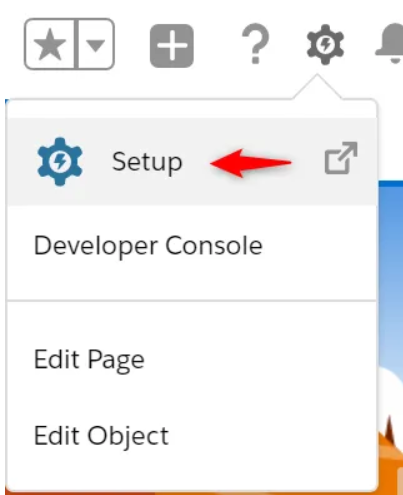
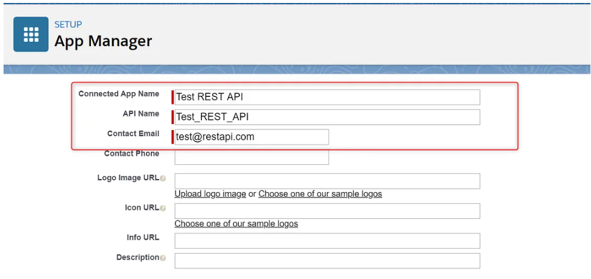
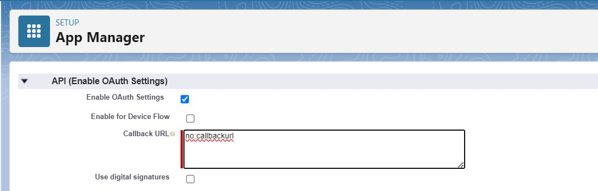
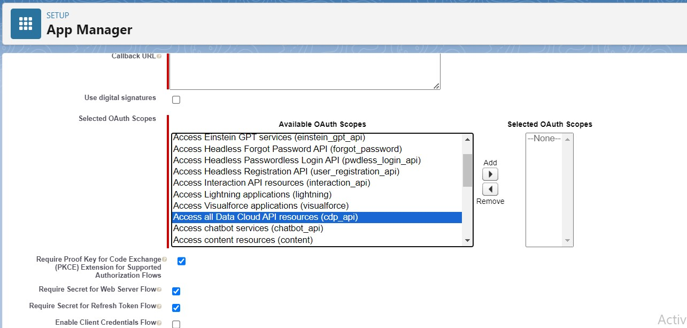
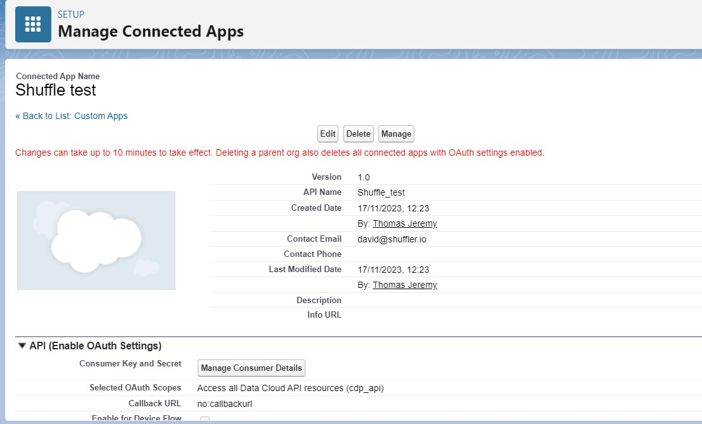
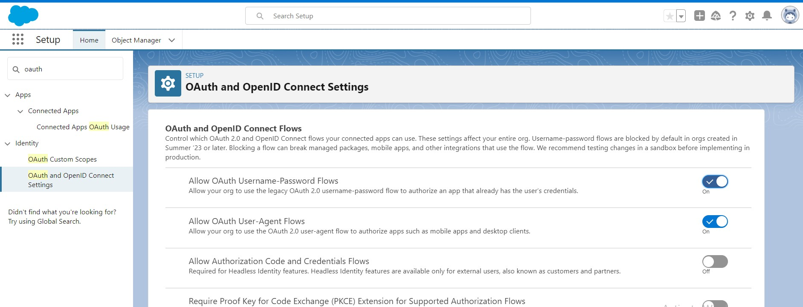

# Salesforce Rest API intergration with Shuffle

## Create a connected app in Salesforce

- Setup > Home> Apps > App Manager > New Connected App




- Set the Name, API Name and Contact email



- Enable OAuth settings and set the Callback URL to no:callbackurl



- Select Oauth scopes, in my case I selected ```Access all Data Cloud API resources (cdp_api)```



- Scroll down and click on save and continue. 

- You will be presented with a page showing all then details you filled



- Click on the Manage Consumer Details for your Consumer Key and Consumer Secret.

- After you store them well go back to the home page and search for ```Reset security token``` click on Reset security token and it should be sent to your email. Store it as you will need it. 


- Still in the home tab search for Oauth and OpenID connect settings. Ensure that  "Allow Oauth Username-Password Flows" is enabled as shown below. 



## Shuffle side

- Get the Salesforce app [here](https://shuffler.io/apps/7485eadf4709746f201942e109c42221) and click on the edit button. You should be presented with the apps parameters as shown below


- Go ahead and fill in the Base url parameter with your Salesforce domain. 
- Then, depending on whether you are using the sandbox or production environment in Salesforce fill in the token url or leave it as is;
    * Sanbox - https://test.salesforce.com/services/oauth2/token
    * Production - https://login.salesforce.com/services/oauth2/token

- Scroll down and hit save

- In Shuffle drag the Salesforce App into you workflow, click on it and click on the Authenticate button.

- Fill in the parameters with the credentials saved from while setting up the connected app in Salesforce. 

NOTE: 

- While filling in the password parameter in Shuffle you will append your Security Token to the password. 
Example: ```PASSWORDSECURITYTOKEN```